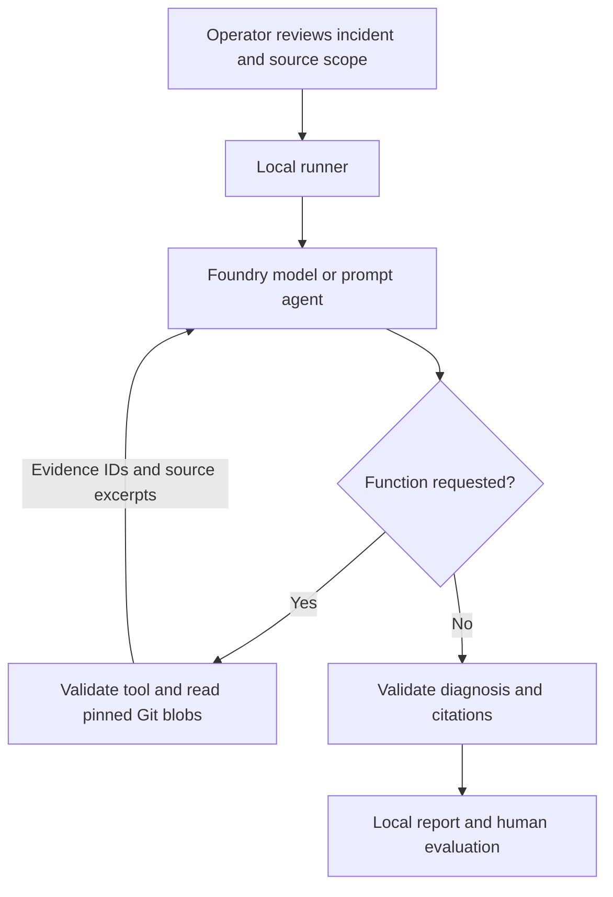

# Architecture and evidence boundaries

The CLI owns local repository access and review. Foundry owns agent reasoning and tool
selection. Function requests are suggestions: local dispatch enforces the allowlist.

## Evidence provenance

Captured incident evidence carries IDs and source labels. The synthetic fixtures explicitly
identify themselves. Real exports should include timestamps, workload/container identity,
image digest, deployed source commit, and actual configuration. Never relabel synthetic
or candidate source as verified live evidence.

Repository retrieval supplies repository ID, commit, path and line range. The operator
must establish the deployed-revision mapping; this version does not discover it.
Files are read using Git object IDs, not working-tree paths or model-supplied shell text.
Git fetching and authentication remain outside model execution. Existing clones can be
updated manually, then a specific commit selected for each investigation.

## Foundry adapter

Uses AzureCliCredential, AIProjectClient, prompt agent versions and the project Responses
client. Baseline bypasses the agent and has no tools. Both use the same model deployment,
incident evidence and diagnosis instructions. Each run has a fresh conversation.

The adapter targets the current project API, not classic hub connection-string APIs.
SDK/API availability and model support must be smoke-tested in the target project.
No API keys or corporate identifiers are embedded in the source.

Reference used for implementation:
https://learn.microsoft.com/en-us/azure/foundry/agents/how-to/tools/function-calling

## Privacy

Preview is entirely local. Explicit approval authorizes the exact incident and the complete
allowed file set for possible retrieval, destination and model. Only requested excerpts
are returned through tools. Repo content and logs may contain sensitive data: no automatic
redaction guarantee is made. Model output can quote that content.

Do not enable SDK HTTP/body or content tracing for sensitive trials without reviewing the
destination and retention policy. Cloud conversations are cleaned up on normal exits;
interrupts, network failures or process death can leave resources. Project monitoring
and billing records have their own retention. .gitignore is not a data-loss-prevention system.

## Future OpsCart adapter

Add an authenticated API accepting the common Incident contract plus an operator-approved
workload mapping. OpsCart can supply captured evidence without changing the engine.
Do not expose arbitrary repository paths, cluster selectors or credentials through that API.
The standalone CLI remains usable. No OpsCart files are changed by this repository.

## Future indexed retrieval

Extract a retriever protocol once a second implementation is justified. Both direct and
indexed retrieval must return the same Evidence objects. Index only approved files and
retain commit/path/line provenance. Apply workload, revision and access filters before
retrieval. Do not index evaluation answers or real incident logs by default.

Azure AI Search is a candidate, not a prerequisite:
https://learn.microsoft.com/en-us/azure/foundry/agents/how-to/tools/ai-search
